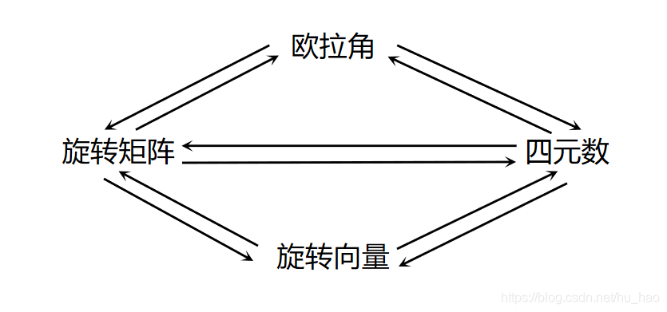

# Eigen  https://eigen.tuxfamily.org/dox/index.html

## 动态大小空间Dynamic

编译时大小未知，

typedef Matrix<double, Dynamic, Dynamic> MatrixXd;

typedef Matrix<int, Dynamic, 1> VectorXi
Matrix<float, 3, Dynamic>

MatrixXd :is a dynamic-size matrix whose size is currently 0-by-0, and whose array of coefficients hasn't yet been allocated at all.

Matrix3f a;

MatrixXf b;

`a` is a 3-by-3 matrix, with a plain float[9] array of uninitialized coefficients, 

`b` is a dynamic-size matrix whose size is currently 0-by-0, and whose array of coefficients hasn't yet been allocated at all.

Constructors taking sizes are also available. For matrices, the number  of rows is always passed first. For vectors, just pass the vector size.  They allocate the array of coefficients with the given size, but don't  initialize the coefficients themselves: 

MatrixXf a(10,15);

VectorXf b(30);

`a` is a 10x15 dynamic-size matrix, with allocated but currently uninitialized coefficients. 

`b` is a dynamic-size vector of size 30, with allocated but currently uninitialized coefficients.

## Resizing

rows(),cols(),size(),resize(),conservativeResize()

## Assignment and resizing

MatrixXf a(2,2);

std::cout << "a is of size " << a.rows() << "x" << a.cols() << std::endl;  a is of size 2x2

MatrixXf b(3,3);

a = b;

std::cout << "a is now of size " << a.rows() << "x" << a.cols() << std::endl;  a is now of size 3x3

## Fixed vs. Dynamic size

The simple answer is: use fixed sizes for very small sizes where you  can, and use dynamic sizes for larger sizes or where you have to. For  small sizes, especially for sizes smaller than (roughly) 16, using fixed sizes is hugely beneficial to performance, as it allows Eigen to avoid dynamic memory allocation and to unroll loops. 

## Optional template parameters

Matrix<typename Scalar,

​       int RowsAtCompileTime,

​       int ColsAtCompileTime,

​       int Options = 0,

​       int MaxRowsAtCompileTime = RowsAtCompileTime,

​       int MaxColsAtCompileTime = ColsAtCompileTime>

RowMajor: It specifies that the matrices of this type use row-major storage order; by default, the storage order is column-major.

Matrix<float, 3, 3, RowMajor>

 MaxRowsAtCompileTime和MaxColsAtCompleTime在您想要指定的情况下很有用，即使在编译时矩阵的确切大小未知，但在编译时固定的上限是已知的。您可能想要这样做的最大原因是避免动态内存分配。例如，下面的矩阵类型使用12个浮点的普通数组，没有动态内存分配 

Matrix<float, Dynamic, Dynamic, 0, 3, 4> // 上限为row = 3 ,col = 4

## Convenience typedefs

MatrixNt for Matrix<type, N, N>. For example, MatrixXi for Matrix<int, Dynamic, Dynamic>. 

MatrixXNt for Matrix<type, Dynamic, N>. For example, MatrixX3i for Matrix<int, Dynamic, 3>. 

MatrixNXt for Matrix<type, N, Dynamic>. For example, Matrix4Xd for Matrix<d, 4, Dynamic>. 

VectorNt for Matrix<type, N, 1>. For example, Vector2f for Matrix<float, 2, 1>. 

RowVectorNt for Matrix<type, 1, N>. For example, RowVector3d for Matrix<double, 1, 3>.

## Matrix and vector arithmetic

矩阵/向量的运算

binary operator + as in `a+b` 

binary operator - as in `a-b` 

unary operator - as in `-a` 

compound operator += as in `a+=b` 

compound operator -= as in `a-=b` 

binary operator * as in `matrix*scalar` 

binary operator * as in `scalar*matrix` 

binary operator / as in `matrix/scalar` 

compound operator *= as in `matrix*=scalar` 

compound operator /= as in `matrix/=scalar` 

## Transposition and conjugation

transpose(),conjugate(),adjoint(),transposeInplace()

MatrixXf a(2,3); a << 1, 2, 3, 4, 5, 6;

cout << "Here is the initial matrix a:\n" << a << endl;

a.transposeInPlace();

cout << "and after being transposed:\n" << a << endl;

```c++
Here is the initial matrix a:
1 2 3
4 5 6
and after being transposed:
1 4
2 5
3 6
```

## Matrix-matrix and matrix-vector multiplication

注意维度

## Dot product and cross product

Eigen::Vector3d v(1,2,3)

Eigen::Vector3d w(0,1,2)

v.dot(w) //点乘

v.cross(w) //差乘

## The Array class and coefficient-wise operations(理解成行列式)？？？

Array类提供通用数组，而Matrix类用于线性代数。此外，Array类提供了一种简单的方法来执行按系数的运算，这种运算可能没有线性代数的含义。

```c++
Array<float,Dynamic,1>          ArrayXf
Array<float,3,1>                Array3f
Array<double,Dynamic,Dynamic>   ArrayXXd
Array<double,3,3>               Array33d
```

## Addition and subtraction

```c++
#include <Eigen/Dense>
#include <iostream>
 
int main()
{
  Eigen::ArrayXXf a(3,3);
  Eigen::ArrayXXf b(3,3);
  a << 1,2,3,
       4,5,6,
       7,8,9;
  b << 1,2,3,
       1,2,3,
       1,2,3;
       
  // Adding two arrays
  std::cout << "a + b = " << std::endl << a + b << std::endl << std::endl;
 
  // Subtracting a scalar from an array
  std::cout << "a - 2 = " << std::endl << a - 2 << std::endl;
    
a + b = 
 2  4  6
 5  7  9
 8 10 12

a - 2 = 
-1  0  1
 2  3  4
 5  6  7
```

## Array multiplication

First of all, of course you can multiply an array by a scalar, this  works in the same way as matrices. Where arrays are fundamentally  different from matrices, is when you multiply two together. Matrices  interpret multiplication as matrix product and arrays interpret  multiplication as coefficient-wise product. Thus, two arrays can be  multiplied if and only if they have the same dimensions.

```c++
#include <Eigen/Dense>
#include <iostream>
 
int main()
{
  Eigen::ArrayXXf a(2,2);
  Eigen::ArrayXXf b(2,2);
  a << 1,2,
       3,4;
  b << 5,6,
       7,8;
  std::cout << "a * b = " << std::endl << a * b << std::endl;
}
a * b = 
 5 12
21 32
```

## Converting between array and matrix expressions

cannot apply [Matrix](https://eigen.tuxfamily.org/dox/classEigen_1_1Matrix.html) operations on arrays, or [Array](https://eigen.tuxfamily.org/dox/classEigen_1_1Array.html) operations on matrices. Thus, if you need to do linear algebraic  operations such as matrix multiplication, then you should use matrices;  if you need to do coefficient-wise operations, then you should use  arrays. 


## Block operations

Block of size (p,q),starting at (i,j)=>matrix.block(i,j,p,q)=>matrix.block<p,q>(i,j)

As always in Eigen, indices start at 0.

## Columns and rows

ith row matrix.row(i)

jth col matrix.col(j)

 ## Corner-related operations

https://eigen.tuxfamily.org/dox/group__TutorialBlockOperations.html

## Slicing and Indexing

不常用

## Advanced initialization

不常用

## Reductions, visitors and broadcasting

不常用

## Reshape

不常用

## STL iterators and algorithms

```c++
VectorXi v = VectorXi::Random(4);
cout << "Here is the vector v:\n";
for(auto x : v) cout << x << " "; //迭代器
cout << "\n";
```

```c++
Array4i v = Array4i::Random().abs();
cout << "Here is the initial vector v:\n" << v.transpose() << "\n";
std::sort(v.begin(), v.end());// 可以使用std::sort
cout << "Here is the sorted vector v:\n" << v.transpose() << "\n";

```

## Interfacing with raw buffers: the Map class

很重要，在后端优化的时候常用

**数字数组转Eigen**：数字数组，希望在Eigen中用作向量或矩阵。虽然一种选择是制作数据的副本，但最常见的情况是，您可能希望将此内存重新用作特征类型。幸运的是，这对于Map类来说非常容易。

```c++
Map<Matrix<typename Scalar,int RowsAtCompileTime,int ColsAtCompileTime>>
```

要构造Map变量，您需要另外两条信息：指向定义系数数组的内存区域的指针，以及所需的矩阵或向量形状。例如，要定义在编译时确定大小的浮点矩阵，可以执行以下操作：

```c++
Map<MatrixXf> mf(pf,rows,cols);
```

`pf` is a `float` `*` pointing to the array of memory. A fixed-size read-only vector of integers might be declared as

```c++
Map<const Vector4i> mi(pi);
Map<const Matrix<int,4,1>> mi(pi);
Map<Matrix<typedef Scalar,int RowsAtCompileTime,int ColsAtCompileTime>> m(array)；// 默认列优先
Map<Matrix<typedef Scalar,int RowsAtCompileTime,int ColsAtCompileTime,ColMajor>> m(array);
Map<Matrix<typedef Scalar,int RowsAtCompileTime,int ColsAtCompileTime,RowMajor>> m(array);// 行优先
```

```c++
int data[] = {1,2,3,4,5,6,7,8,9};
Map<RowVectorXi> v(data,4);
cout << "The mapped vector v is: " << v << "\n";//1 2 3 4
new (&v) Map<RowVectorXi>(data+4,5);
cout << "Now v is: " << v << "\n";// 5 6 7 8 9
```

## Reference  

https://eigen.tuxfamily.org/dox/group__QuickRefPage.html

# Dense linear problems and decompositions

**很重要**：要开始解方程了 
$$
Ax=b
$$
Where *A* and *b* are matrices (*b* could be a vector, as a special case). You want to find a solution *x*.

若A为mxn（列为Rm，行为Rn）的矩阵，它的各列为a1,……an.若x为Rn中的向量，则A与x的积（Ax）就是A的各列以x中对应的元素为权的线性组合。

Ax=[a1,a2,……,an]*[x1,x2……,xn].transpose()=x1 * a1 + x2 * a2 + …… + xn * an;

**解集相同**

若A是mxn矩阵，它的各列为a1,……an，而b属于Rm,Ax = b

x1 * a1 + x2 * a2 + …… + xn * an = b;

增广矩阵为：

[a1,a2,……,an,b]

方程Ax=b 有解当且仅当，b是A的各列的线性组合；

Ax 的行向量规则：

若乘积Ax有定义，则Ax中的第ℹ个元素是A的第ℹ行元素与x的相应元素乘积之和；

**线性方程组**

Ax=0

若A为mxn（列为Rm，行为Rn）的矩阵，0是Rm中的零向量。这样方程组至少有一个解x=0（Rn中的零向量）；

其次方程Ax=0有通解，当且仅当方程至少有一个自由变量。

Ax = b 的解集是一条通过p（特解，方向）而平行于Ax = 0的结集的直线。就是将Ax=0的结集沿着p方向进行平移。

矩阵A的各列线性无关，当且仅当方程Ax=0，仅有平凡解x={0}

[m*n] [Rn] = [Rm] <=> Ax = b 也就是Rn -> Rm

AB 的每一列都是A的各列的线性组合，以B的对应列的元素为权。

**矩阵因式分解：**

矩阵A 的因式分解是把A表示为两个或更多个矩阵的乘积。

**LU分解：A为mxn矩阵，L为mxm的下三角矩阵，主对角线元素为1，U为mxn的上三角矩阵。**

A=LU方程Ax = b可以写为L(Ux) = b，Ly = b, Ux = y。首先解Ly = b求得y，然后解Ux = y求得x。

**LU分解算法 ： **

设A可以化为阶梯型U，化简过程中仅使用行倍加变换，这样存在单位下三角初等矩阵E1，……，Ep使：

Ep……E1A=U

于是

A=（Ep……E1）^-1U = LU

L = (Ep……E1)^-1下三角单位矩阵的乘积和逆也是单位下三角矩阵。

Ep……E1 * L = (Ep……E1)(Ep……E1)^-1 = I

1、如果可能的话，用一系列的行的倍加变换把A化为阶梯型U

2、填充L的元素使相同的行变换把L变为I

 **列空间与零空间**

矩阵A的**列空间**是A的各列的线性组合的集合，记作ColA；

如A = [a1,……,an]他们属于Rm，则ColA和Span{a1,……,an}相同，mxn矩阵的列空间是Rm的子空间，仅当A的列生成Rm时，ColA等于Rm，否则ColA仅是Rm的一部分。

当线性方程组写成Ax = b的形式时，A的列空间是所使方程组有解的向量b的集合。

矩阵A的零空间，是其次方程Ax=0的所有解的集合，记为NulA。

当A有n列时，Ax=0的解属于Rn，A的凌空间是Rn的子集。

矩阵A的主元列构成A的列空间的基。

**要用A的主元列作为ColA的基，阶梯型B的列通常并不在A的列空间内。**

**子空间的维数：**

非零子空间H的维数（dimH）是H的任意一个基的向量个数，零子空间{0}的维数定义为零。

矩阵A的秩，是A的列空间的维数。

Pivot of A + Free of A = Cols of A

如果一矩阵A有n列，则rankA + dim Nul A = n

dim Nul A  = Free of A

$R^n$ 的子空间通常由以下两种方式产生：

1、作为齐次线性方程组的结集；

2、作为某些确定向量的线性组合的集合。

满足Ax = 0的所有x的集合为矩阵A的零空间，属于$R^n$。求解的是未知数的个数。

mxn矩阵A的零空间是Rn的一个子空间，等价地，m个方程、n个未知数的其次线性方程组Ax = 0的全体解的集合是Rn的一个子空间。

mxn矩阵A的列空间（ColA）是由A的列的所有线性组合组成的集合，A=[a1,……,an]，则ColA = Span{a1,……,an}

mxn矩阵A的列空间是Rm的一个子空间。

mxn矩阵A的列空间等于Rm当且仅当方程Ax = b对于Rm中的每个b有一个解。

**生成集定理：**

令S = {v1,……,vp}是V中的向量集，H = Span{v1,……,vp}

1、若S中某一个向量（比如说vk）是S中其余向量的线性组合，则S中去掉vk后形成的集合仍然可以生成H。

2、若H != {0}，则S的某一子集是H的一个基。

矩阵A的主元列构成ColA的一个基。

NulA的维数是方程Ax = 0中的自由变量的个数，ColA的维数是A中主元列的个数。

A 的秩即A的列空间的维数。

rank A = pivot of A;

rankA + dim Nul A = n

pivot of A + free of A = n

三角矩阵的主对角线的元素是其特征值。

$\lambda_1,...,\lambda_r$ 是nxn矩阵A相异的特征值，$v_1,...,v_r$ 是与$\lambda_1,...,\lambda_r$ 对应的特征向量，那么向量集合$v_1,...,v_r$ 线性相关。

## 特征值与特征向量

三角矩阵的主对角线的元素是其特征值。

特征值相异，特征向量线性无关。

假如A和B是nxn矩阵，如果存在可逆矩阵P，使得P^-1AP=B，或等价的A=PBP^-1，则称A相似于B。

若nxn矩阵A和B是相似的，那么他们有相同的特征多项式，从而有相同的特征值。

有相同的特征值不一定相似。

相似性与行等价不是一回事，对矩阵进行行变换通常会改变矩阵特征值。

对角化：特征值与特征向量。

如果方阵A相似于对角矩阵，即存在可逆矩阵P和对角矩阵D，有A = PDP^-1，则称A可对角化。

**对角化定理**

1、nxn矩阵A可对角化的充分必要条件是A有n个线性无关的特征向量。

2、A=PDP^-1，D为对角矩阵的充分必要条件是P的列向量是A的n个线性无关的特征向量。此时，D的主对角线上的元素分别是A的对应于P中特征向量的特征值。

有n个相异特征值的nxn矩阵可对角化。

设A是nxn矩阵，其相异的特征值是$\lambda_1,...\lambda_p$.

a、对于1=<k<=p ,$\lambda_k$ 的特征空间的维数小于或等于$\lambda_k$ 的代数重数。

b、矩阵A可对角化的充分条件是所有不同特征空间的维数之和为n，即特征多项式可以完全分解为线性因子，每个$\lambda_k$的特征空间的维数等于$\lambda_k$ 的代数重数。

c、特征向量线性无关.

**矩阵的QR分解：**

如果mxn矩阵A的列x1,...,xn线性无关，那么应用格拉姆-史密特方法，于x1,...,xn等同于对A进行分解。

如果mxn矩阵A的列x1,...,xn线性无关，那么A可以分解为A=QR，其中Q是一个mxn矩阵，其列形成ColA的一个标准正交基，R是一个nxn上三角可逆矩阵，且在对角线上的元素为正数。

Ax=b -> QRx=b ->  Q^T(QRx)=Q^Tb -> Rx = Q^Tb

因为Q为列正交，所以Q^TQ=I（Gram-Schmidt进行QR分解）

R：为mxm的上三角，且可逆

Q^T :Q的转至。

**Householder QR分解：**


**最小二乘问题：**

解不存在的巨型方程Ax=b，寻找x使得Ax尽可能的接近b。

b和Ax之间的距离越小，$\lVert b - Ax \rVert$近似度越好，一般最小二乘问题就是找出使$\lVert b-Ax \rVert$ 尽量小的x，$\lVert b - Ax \rVert$ 是平方和的平方根。

如果mxn矩阵A和向量b属于$R^m$ 则Ax=b的最小二乘解是$R^n$ 中的$\hat{x}$ 使得
$$
\lVert b - A\hat{x} \rVert \le \lVert b - Ax \rVert
$$
对所有$x \in R^n$ 成立。

最小二乘问题最重要的特征是无论怎么选取x，向量Ax必然属于列空间ColA，因此我们寻求x，使得Ax是ColA中最接近b的点。

**一般最小二乘问题的解：**

对给定A与b，应用最佳逼近定理于子空间ColA，取
$$
\hat{b} = proj_{ColA} b
$$
由于$\hat{b}$ 属于A的列空间，故方程$Ax = \hat{b}$ 是相容的且存在一个$R^n$ 的 $\hat{x}$ 使得
$$
A\hat{x} = \hat{b}
$$
由于$\hat{b}$ 是ColA中最接近b的点，因此一个向量$\hat{x}$ 是Ax=b的一个最小二乘解的充分必要条件是$\hat{x}$ 满足$A\hat{x} = \hat{b}$ 。这个属于$R^n$ 的$\hat{x}$ 是一系列由A的列构造的$\hat{b}$ 的权。
$$
A^TA\hat{x} = A^Tb
$$
假设A是mxn矩阵：

1）对于$R^m$ 中每个b，方程Ax=b有唯一最小二乘解；

2）A的列是线性无关的，这样A的每一列才是$R^n$ 的基；

3）$A^TA$ 可逆。

这样$\hat{x} = (A^TA)^{-1}A^Tb$ 

当最小二乘解$\hat{x}$ 用于产生b的近似$A\hat{x}$ 时，从b到$A\hat{x}$ 的距离称为这个近似的最小二乘误差。

某些时候，最小二乘解问题的方法可能是病态的，也就是$A^TA$ 的元素在计算中出现小误差有时可能导致解$\hat{x}$ 中出现较大误差，如果A的列线性无关，则最小二乘通常可以使用A的QR分解可靠的求出。
$$
A\hat{x} = b\\
QR\hat{x} = b, Q^TQ=I\\
Q^TQR\hat{x} = Q^Tb\\
R\hat{x} = Q^Tb\\
\hat{x} = R^{-1}Q^Tb
$$
 通常情况下，为了方便计算不求$R^{-1}$ 而是对方程
$$
R\hat{x} = Q^Tb
$$
对A进行QR分解，求出QR，然后，计算$Q^Tb$ ，回代，利用高斯消元进行求解。


## 对称矩阵和二次型

一个对称矩阵是一个满足$A^T = A$ 的矩阵A。

如果A是对称矩阵，那么不同特征空间的任意两个特征向量正交。

一个nxn矩阵A可正交对角化的充分必要条件是A是对称矩阵。

矩阵A的特征值的集合有时称为A的谱

一个对称nxn矩阵A具有下述定理：

1、A有n个实特征值，包含重复的特征值；

2、对每一个特征值$\lambda$，对应的特征空间的维数等于$\lambda$ 作为特征方程的根的重数；

3、特征空间相互正交，这种正交性是在特征向量对应于不同特征值的意义下成立的。

4、A可正交对角化。

**奇异值分解的简化和A的伪逆**

当$\sum$包含零元素的行或列时，矩阵A具有更简洁的分解，取rankA = r，将U和V矩阵分块分为第一块包含r列的子矩阵：

$U = [U_r  U_{m-r}] 其中 U_r = [u_1 ... u_r]$

${n-r}] 其中 V_r = [v_1 ... v_r]$

那么$U_r$ 为mxr，$V_r$ 为nxr。
$$
A = \begin{bmatrix}
U_r U_{m-r} 
\end{bmatrix} \begin{bmatrix}
D & 0\\
0 & 0
\end{bmatrix} \begin{bmatrix}
V_r^T \\
V_{n-r}^T
\end{bmatrix} = U_rDV_r^T

\\
\\
A^+ = V_rD^{-1}U_r^T
$$

$$
Ax = b
\\
\hat x = A^+b = V_rD^{-1}U_r^Tb
\\
A\hat x = (U_rDV_r^T)(V_rD^{-1}U_r^Tb)\\
= U_rDD^{-1}U_r^Tb\\
=U_rU_r^Tb
$$

$U_rU_r^Tb$ 是b在ColA上的正交投影矩阵$\hat b$ 因此$\hat x$ 是Ax=b的最小二乘。实际上，这个$\hat x$ 在Ax=b 的所有最小二乘解中具有最小长度。

## Linear algebra and decompositions


```c++
#include <iostream>
#include <Eigen/Dense>
 
int main()
{
   Eigen::Matrix2f A, b;
   A << 2, -1, -1, 3;
   b << 1, 2, 3, 1;
   std::cout << "Here is the matrix A:\n" << A << std::endl;
   std::cout << "Here is the right hand side b:\n" << b << std::endl;
   Eigen::Matrix2f x = A.ldlt().solve(b);
   std::cout << "The solution is:\n" << x << std::endl;
}
```

求解Ax=b的方法：

partialPivLU()

FullPixLU()

HouseholderQR()

ColPivHouseholderQR()

completeOrthogonalDecomposition()

LLT()

LDLT()


```c++
#include <iostream>
#include <Eigen/Dense>
 
int main()
{
   Eigen::MatrixXf A = Eigen::MatrixXf::Random(3, 2);
   std::cout << "Here is the matrix A:\n" << A << std::endl;
   Eigen::VectorXf b = Eigen::VectorXf::Random(3);
   std::cout << "Here is the right hand side b:\n" << b << std::endl;
   std::cout << "The least-squares solution is:\n"
        << A.template bdcSvd<Eigen::ComputeThinU | Eigen::ComputeThinV>().solve(b) << std::endl;
}
```

BDCSVD()

JacobiSVD()

**Checking if a matrix is singular**

```C++
#include <iostream>
#include <Eigen/Dense>
 
using Eigen::MatrixXd;
 
int main()
{
   MatrixXd A = MatrixXd::Random(100,100);
   MatrixXd b = MatrixXd::Random(100,50);
   MatrixXd x = A.fullPivLu().solve(b);
   double relative_error = (A*x - b).norm() / b.norm(); // norm() is L2 norm
   std::cout << "The relative error is:\n" << relative_error << std::endl;
}
```

**Computing eigenvalues and eigenvectors**

```C++
#include <iostream>
#include <Eigen/Dense>
 
int main()
{
   Eigen::Matrix2f A;
   A << 1, 2, 2, 3;
   std::cout << "Here is the matrix A:\n" << A << std::endl;
   Eigen::SelfAdjointEigenSolver<Eigen::Matrix2f> eigensolver(A);
   if (eigensolver.info() != Eigen::Success) abort();
   std::cout << "The eigenvalues of A are:\n" << eigensolver.eigenvalues() << std::endl;
   std::cout << "Here's a matrix whose columns are eigenvectors of A \n"
        << "corresponding to these eigenvalues:\n"
        << eigensolver.eigenvectors() << std::endl;
}
```

https://eigen.tuxfamily.org/dox/group__TopicLinearAlgebraDecompositions.html

### Solving linear least squares systems

1、Using the SVD decomposition

2、Using the QR decomposition

3、Using normal equations

```c++
(A.transpose()*A).ldlt().solve(A.transport()*b)
```

| [SparseCore ](https://eigen.tuxfamily.org/dox/group__SparseCore__Module.html) | #include <Eigen/SparseCore>             | [SparseMatrix](https://eigen.tuxfamily.org/dox/classEigen_1_1SparseMatrix.html) and [SparseVector](https://eigen.tuxfamily.org/dox/classEigen_1_1SparseVector.html) classes, matrix assembly, basic sparse linear algebra (including sparse triangular solvers) |
| ------------------------------------------------------------ | --------------------------------------- | ------------------------------------------------------------ |
| [SparseCholesky ](https://eigen.tuxfamily.org/dox/group__SparseCholesky__Module.html) | #include <Eigen/SparseCholesky>         | Direct sparse [LLT](https://eigen.tuxfamily.org/dox/classEigen_1_1LLT.html) and [LDLT](https://eigen.tuxfamily.org/dox/classEigen_1_1LDLT.html) Cholesky factorization to solve sparse self-adjoint positive definite problems |
| [SparseLU ](https://eigen.tuxfamily.org/dox/group__SparseLU__Module.html) | #include<Eigen/SparseLU>                | Sparse LU factorization to solve general square sparse systems |
| [SparseQR ](https://eigen.tuxfamily.org/dox/group__SparseQR__Module.html) | #include<Eigen/SparseQR>                | Sparse QR factorization for solving sparse linear least-squares problems |
| [IterativeLinearSolvers ](https://eigen.tuxfamily.org/dox/group__IterativeLinearSolvers__Module.html) | #include <Eigen/IterativeLinearSolvers> | Iterative solvers to solve large general linear square problems (including self-adjoint positive definite problems) |
| [Sparse ](https://eigen.tuxfamily.org/dox/group__Sparse__Module.html) | #include <Eigen/Sparse>                 | Includes all the above modules                               |

https://eigen.tuxfamily.org/dox/group__TopicSparseSystems.html

## Geometry




